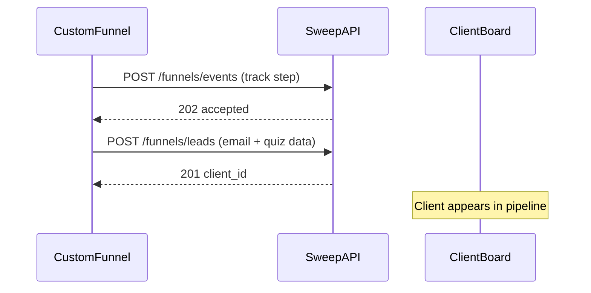

# Sweep OS Funnel Integration Guide (Master)

**Single source of truth for integrating custom-built funnels with Sweep OS.** Share this document with an LLM or developer to wire event tracking and lead capture from any site, quiz, or checkout you control.

---

## Table of Contents

1. [For LLM implementers (start here)](#for-llm-implementers-start-here)
2. [Overview](#overview)
3. [Custom funnel integration playbook](#custom-funnel-integration-playbook)
4. [API reference](#api-reference)
5. [Event ingestion](#event-ingestion)
6. [Lead capture (Client Board)](#lead-capture-client-board)
7. [Implementation examples](#implementation-examples)
8. [Best practices](#best-practices)
9. [Testing & troubleshooting](#testing--troubleshooting)

---

## For LLM implementers (start here)

Use this checklist when building or editing funnel tracking code. Do **not** invent auth headers, GraphQL, or WebSockets — only the two public REST endpoints below exist for external funnels.

### Inputs you need from the human

| Input | Where to get it |
|-------|-----------------|
| `API_BASE_URL` | Sweep backend URL, e.g. `https://api.sweepai.site` or `http://localhost:8000` |
| `FUNNEL_ID` | Sweep OS → Funnels → funnel → **Overview** tab (UUID) |
| Step `event_name` values | Funnels → **Steps** tab — strings must match **exactly** (case-sensitive) |

### What to implement

1. **Identity helpers** (browser only)
   - `visitor_id` → `localStorage` (stable across visits)
   - `session_id` → `sessionStorage` (new per tab/session)

2. **`trackEvent(eventName, metadata?, idempotencyKey?)`**
   - `POST {API_BASE_URL}/funnels/events`
   - `Content-Type: application/json`
   - No `Authorization` header
   - Fire-and-forget: never block UI on failure; log errors only

3. **`submitLead(payload)`** (when the user completes a form/quiz)
   - `POST {API_BASE_URL}/funnels/leads`
   - Same headers; no auth
   - Call **after** you have at least one of: `email`, `name`, `first_name`/`last_name`, `phone`, `instagram`

4. **Step mapping**
   - Every funnel step in Sweep OS has an `event_name`. Your custom funnel must call `trackEvent` with that exact string when the user hits that step (page view, quiz screen, submit, payment, etc.).

5. **Idempotency** (recommended for all retried actions)
   - Include `idempotency_key` on `POST /funnels/events` when the client might retry (form submit, payment, webhook replay).
   - First request → `202`, `"status": "accepted"`.
   - Same key again (same org) → `202`, `"status": "duplicate"` (no new row).
   - Keys are scoped to the **organization** (derived from `funnel_id`), not per funnel — prefix keys: `{funnel_id}_{event}_{unique_id}`.

### Minimal happy-path sequence (quiz funnel)

```text
1. User lands        → trackEvent('quiz_page_view', { page_id: 'intro' })
2. User starts quiz  → trackEvent('quiz_start', { form_id: 'root-quiz' })
3. User submits form → trackEvent('form_submit', { form_id: 'root-quiz' }, 'form_submit_{sessionId}_{formId}')
4. Same moment       → submitLead({ funnel_id, email, name, quiz_answers, source: 'quiz', funnel_step_reached: 'form_submit' })
```

### Do not

- Omit `funnel_id` on either endpoint (400).
- Guess `event_name` strings — they must match Sweep funnel steps.
- Use `idempotency_key` on `/funnels/leads` (not supported; match leads by `email` server-side).
- Block navigation or payment on tracking errors.

### Verify

```bash
# Event (with idempotency — should be 202 accepted)
curl -sS -X POST "${API_BASE_URL}/funnels/events" \
  -H "Content-Type: application/json" \
  -d '{"funnel_id":"YOUR_FUNNEL_UUID","event_name":"form_submit","visitor_id":"v1","session_id":"s1","metadata":{"form_id":"root-quiz"},"idempotency_key":"test_key_001"}'

# Repeat same idempotency_key — should be 202 duplicate
curl -sS -X POST "${API_BASE_URL}/funnels/events" \
  -H "Content-Type: application/json" \
  -d '{"funnel_id":"YOUR_FUNNEL_UUID","event_name":"form_submit","visitor_id":"v2","session_id":"s2","metadata":{"form_id":"root-quiz"},"idempotency_key":"test_key_001"}'
```

---

## Overview

Sweep OS tracks funnel events and leads via REST APIs. Both public ingestion endpoints are **unauthenticated**. The server resolves `org_id` from `funnel_id`.

| Endpoint | Method | Purpose |
|----------|--------|---------|
| `/funnels/events` | `POST` | Track user actions (page views, quiz steps, form submits, payments) |
| `/funnels/leads` | `POST` | Create or update a client on the Client Board |

**Base URL:** `{API_BASE_URL}` with **no** `/api` prefix unless your deployment adds one. Production example: `https://api.sweepai.site`.

**Router mount:** `backend/app/main.py` → `app.include_router(funnels.router, prefix="/funnels")`.



**Key concepts:**

- **Funnel** — Logical sequence configured in Sweep OS (name, optional domain/slug).
- **Funnel step** — Row in Steps tab; `event_name` is what you send in `POST /funnels/events`.
- **Event** — One tracked action; stored with `visitor_id`, `session_id`, optional `metadata`.
- **Lead** — Client record created/updated via `POST /funnels/leads`.

---

## Custom funnel integration playbook

### Phase 1 — Configure Sweep OS (human / dashboard)

1. Funnels → **+ New Funnel** → name, optional domain/slug/environment.
2. **Steps** tab — add one row per trackable step, e.g.:
   - `quiz_page_view` — user sees a quiz screen
   - `quiz_start` — user begins the quiz
   - `form_submit` — user submits contact/qualification form
   - `payment_succeeded` — checkout completed
3. Copy **Funnel ID** from Overview.

### Phase 2 — Map your UI to `event_name`

Build a table in your funnel repo (or env config):

| Your screen / action | Sweep `event_name` | Idempotent? |
|----------------------|-------------------|-------------|
| Landing page load | `page_view` or `quiz_page_view` | No |
| Quiz step N | `quiz_step_{n}` or shared `quiz_page_view` + `metadata.step` | No |
| Form submit | `form_submit` | **Yes** — use `idempotency_key` |
| Stripe success | `payment_succeeded` | **Yes** — use payment intent / txn id |

### Phase 3 — Shared client module

Implement one module (TypeScript or vanilla JS) that exports:

- `getVisitorId()` / `getSessionId()`
- `trackEvent(name, metadata?, idempotencyKey?)`
- `submitLead(fields)`

Use env vars:

```bash
NEXT_PUBLIC_API_BASE_URL=https://api.sweepai.site
NEXT_PUBLIC_FUNNEL_ID=ee46f8a6-ace5-4dd1-9279-abf58ae6ae9c
```

### Phase 4 — Wire each screen

- **SPA / Next.js:** call `trackEvent` in `useEffect` on route change or on button handlers.
- **Static HTML:** inline script on `load` / form `submit`.
- **Server-side form handler:** optionally call `/funnels/events` from the server (no CORS issue); still use `idempotency_key` for submits.

### Phase 5 — Lead handoff to pipeline

On successful form/quiz completion:

1. `trackEvent('form_submit', { form_id, ... }, idempotencyKey)` — analytics + funnel health.
2. `submitLead({ funnel_id, email, name, phone, quiz_answers, source: 'quiz', funnel_step_reached: 'form_submit' })` — creates/updates Client Board row.

New clients are created with `lifecycle_state: "qualified"` (see [Lead capture](#lead-capture-client-board)).

### Phase 6 — Payments (if applicable)

```typescript
await trackEvent(
  'payment_succeeded',
  {
    amount_cents: 5000,
    currency: 'usd',
    transaction_id: 'pi_abc123',
  },
  `payment_pi_abc123` // idempotency_key — stable per charge
);
```

---

## API reference

### POST /funnels/events

Ingest a funnel event. **Public.** Org resolved from `funnel_id`.

**Request body (JSON):**

| Field | Type | Required | Description |
|-------|------|----------|-------------|
| `funnel_id` | UUID string | Yes | From funnel Overview |
| `event_name` | string (1–100) | Yes | Must match a funnel step exactly |
| `visitor_id` | string | Recommended | Stable per browser |
| `session_id` | string | Recommended | Per visit/tab |
| `client_id` | UUID string | No | Link to existing client (same org) |
| `metadata` | object | No | Arbitrary JSON: `page_url`, `form_id`, `utm`, `amount_cents`, etc. |
| `event_timestamp` | ISO 8601 | No | Client time; defaults to server `now` |
| `idempotency_key` | string | No | Dedupes retries within the org (see [Idempotency](#idempotency)) |

**Example — form submit with idempotency:**

```json
{
  "funnel_id": "ee46f8a6-ace5-4dd1-9279-abf58ae6ae9c",
  "event_name": "form_submit",
  "visitor_id": "visitor_abc",
  "session_id": "session_xyz",
  "metadata": {
    "form_id": "root-quiz",
    "page_url": "https://example.com/quiz",
    "page_title": "Tailoring Quiz"
  },
  "idempotency_key": "form_submit_session_xyz_root-quiz"
}
```

**Responses (always HTTP 202 on success path):**

```json
{ "event_id": "82c9029e-4b0b-4ab1-abad-0dd41f6be3ad", "status": "accepted" }
```

```json
{ "event_id": "82c9029e-4b0b-4ab1-abad-0dd41f6be3ad", "status": "duplicate" }
```

| HTTP | Meaning |
|------|---------|
| 202 | Event accepted or duplicate (check `status`) |
| 400 | Missing `funnel_id` or validation error |
| 404 | Funnel or `client_id` not found |
| 500 | Server error (see [Troubleshooting](#testing--troubleshooting)) |

**Implementation note:** `idempotency_key` is stored inside `event_metadata` on the server. Duplicate detection uses org-scoped JSON containment (PostgreSQL `jsonb` cast). Safe to use on **any** event type, not only payments.

---

### POST /funnels/leads

Create or update a client on the Client Board. **Public.** Org resolved from `funnel_id`.

**Request body (JSON):**

| Field | Type | Required | Description |
|-------|------|----------|-------------|
| `funnel_id` | UUID string | Yes | From funnel Overview |
| `email` | string | Conditional | Used to match existing client |
| `name` | string | Conditional | Full name; split if `first_name`/`last_name` omitted |
| `first_name` | string | Conditional | |
| `last_name` | string | Conditional | |
| `phone` | string | Conditional | |
| `instagram` | string | Conditional | e.g. `@username` |
| `notes` | string | No | Appended when updating existing client |
| `source` | string | No | e.g. `quiz`, `opt_in`, `form` |
| `quiz_answers` | object | No | Structured answers (stored under `client.meta.prospect`) |
| `opt_in_data` | object | No | Consent/preferences |
| `funnel_step_reached` | string | No | Last step name at capture time |

**Validation:** At least one of `email`, `name`, `first_name`/`last_name`, `phone`, or `instagram` when **creating** a new client.

**Response (201):**

```json
{ "client_id": "uuid", "created": true, "message": "Client created" }
```

```json
{ "client_id": "uuid", "created": false, "message": "Client updated" }
```

| HTTP | Meaning |
|------|---------|
| 201 | Client created or updated |
| 400 | Validation failed (e.g. no contact fields) |
| 404 | Funnel not found |

---

## Event ingestion

### Metadata recommendations

```json
{
  "page_url": "https://example.com/current-page",
  "page_title": "Page Title",
  "form_id": "root-quiz",
  "utm": { "source": "google", "medium": "cpc", "campaign": "summer" },
  "referrer": "https://google.com"
}
```

For payments, also include: `amount_cents`, `currency`, `transaction_id`.

### Idempotency

**When to use:** Any action that may be retried — `form_submit`, `payment_succeeded`, webhook-driven events, double-click submits.

**Key format (recommended):**

```text
{event_name}_{stable_unique_id}
```

Examples:

- `form_submit_session_abc_root-quiz`
- `payment_pi_3NxYz...`
- `quiz_complete_visitor_abc_2026-06-05`

**Behavior:**

1. First `POST` with a new key → `202`, `status: "accepted"`, new `event_id`.
2. Second `POST` with the same key (same org) → `202`, `status: "duplicate"`, **same** `event_id`, no new event row.
3. Keys are **org-wide** (all funnels in the org share one idempotency namespace). Prefix with funnel or form id to avoid collisions.

**Without `idempotency_key`:** each request creates a new event (fine for page views).

---

## Lead capture (Client Board)

- **Endpoint:** `POST /funnels/leads`
- **Auth:** None
- **New clients** are created with `lifecycle_state: "qualified"` and appear on the Client Board pipeline (column depends on your board configuration).
- **Existing clients** are matched by normalized `email`; fields are merged, `notes` appended.
- **Prospect payload** (`source`, `quiz_answers`, `opt_in_data`, `funnel_step_reached`) is stored on `client.meta.prospect` for AI health scoring. Combined `quiz_answers` + `opt_in_data` JSON is capped at **50 KB**.

**Typical quiz funnel payload:**

```json
{
  "funnel_id": "ee46f8a6-ace5-4dd1-9279-abf58ae6ae9c",
  "email": "lead@example.com",
  "name": "Jane Doe",
  "phone": "+15551234567",
  "source": "quiz",
  "funnel_step_reached": "form_submit",
  "quiz_answers": {
    "goal": "custom_suit",
    "budget": "2000_5000",
    "timeline": "30_days"
  },
  "notes": "Completed Nitto tailoring quiz"
}
```

---

## Implementation examples

### TypeScript module (copy-paste for custom funnels)

```typescript
const API_BASE_URL = process.env.NEXT_PUBLIC_API_BASE_URL ?? 'http://localhost:8000';
const FUNNEL_ID = process.env.NEXT_PUBLIC_FUNNEL_ID ?? '';

function getVisitorId(): string {
  if (typeof window === 'undefined') return '';
  let v = localStorage.getItem('sweep_visitor_id');
  if (!v) {
    v = `visitor_${Date.now()}_${Math.random().toString(36).slice(2, 11)}`;
    localStorage.setItem('sweep_visitor_id', v);
  }
  return v;
}

function getSessionId(): string {
  if (typeof window === 'undefined') return '';
  let s = sessionStorage.getItem('sweep_session_id');
  if (!s) {
    s = `session_${Date.now()}_${Math.random().toString(36).slice(2, 11)}`;
    sessionStorage.setItem('sweep_session_id', s);
  }
  return s;
}

export type TrackResult = { ok: true; status: 'accepted' | 'duplicate'; eventId?: string } | { ok: false; error: string };

export async function trackEvent(
  eventName: string,
  metadata: Record<string, unknown> = {},
  idempotencyKey?: string
): Promise<TrackResult> {
  if (!FUNNEL_ID) return { ok: false, error: 'FUNNEL_ID not configured' };

  const body: Record<string, unknown> = {
    funnel_id: FUNNEL_ID,
    event_name: eventName,
    visitor_id: getVisitorId(),
    session_id: getSessionId(),
    metadata: {
      ...metadata,
      page_url: typeof window !== 'undefined' ? window.location.href : undefined,
      page_title: typeof document !== 'undefined' ? document.title : undefined,
      referrer: typeof document !== 'undefined' ? document.referrer || undefined : undefined,
    },
    event_timestamp: new Date().toISOString(),
  };
  if (idempotencyKey) body.idempotency_key = idempotencyKey;

  try {
    const res = await fetch(`${API_BASE_URL}/funnels/events`, {
      method: 'POST',
      headers: { 'Content-Type': 'application/json' },
      body: JSON.stringify(body),
    });
    if (!res.ok) {
      const detail = await res.json().catch(() => ({}));
      return { ok: false, error: (detail as { detail?: string }).detail ?? res.statusText };
    }
    const data = (await res.json()) as { event_id?: string; status?: string };
    return {
      ok: true,
      status: data.status === 'duplicate' ? 'duplicate' : 'accepted',
      eventId: data.event_id,
    };
  } catch (e) {
    return { ok: false, error: e instanceof Error ? e.message : 'network error' };
  }
}

export type LeadPayload = {
  email?: string;
  name?: string;
  first_name?: string;
  last_name?: string;
  phone?: string;
  instagram?: string;
  notes?: string;
  source?: string;
  quiz_answers?: Record<string, unknown>;
  opt_in_data?: Record<string, unknown>;
  funnel_step_reached?: string;
};

export async function submitLead(fields: LeadPayload): Promise<{ clientId?: string; created?: boolean; error?: string }> {
  if (!FUNNEL_ID) return { error: 'FUNNEL_ID not configured' };

  try {
    const res = await fetch(`${API_BASE_URL}/funnels/leads`, {
      method: 'POST',
      headers: { 'Content-Type': 'application/json' },
      body: JSON.stringify({ funnel_id: FUNNEL_ID, ...fields }),
    });
    const data = await res.json().catch(() => ({}));
    if (!res.ok) {
      return { error: (data as { detail?: string }).detail ?? res.statusText };
    }
    const row = data as { client_id: string; created: boolean };
    return { clientId: row.client_id, created: row.created };
  } catch (e) {
    return { error: e instanceof Error ? e.message : 'network error' };
  }
}

/** Example: quiz form submit — track + lead in one helper */
export async function onQuizFormSubmit(input: {
  email: string;
  name: string;
  formId: string;
  quizAnswers: Record<string, unknown>;
}) {
  const sessionId = getSessionId();
  const idempotencyKey = `form_submit_${sessionId}_${input.formId}`;

  void trackEvent('form_submit', { form_id: input.formId }, idempotencyKey);

  return submitLead({
    email: input.email,
    name: input.name,
    source: 'quiz',
    funnel_step_reached: 'form_submit',
    quiz_answers: input.quizAnswers,
  });
}
```

### Vanilla JavaScript

```javascript
const API_BASE_URL = 'https://api.sweepai.site';
const FUNNEL_ID = 'your-funnel-uuid';

function getVisitorId() {
  let v = localStorage.getItem('sweep_visitor_id');
  if (!v) {
    v = 'visitor_' + Date.now() + '_' + Math.random().toString(36).slice(2, 11);
    localStorage.setItem('sweep_visitor_id', v);
  }
  return v;
}

function getSessionId() {
  let s = sessionStorage.getItem('sweep_session_id');
  if (!s) {
    s = 'session_' + Date.now() + '_' + Math.random().toString(36).slice(2, 11);
    sessionStorage.setItem('sweep_session_id', s);
  }
  return s;
}

async function trackEvent(eventName, metadata, idempotencyKey) {
  const body = {
    funnel_id: FUNNEL_ID,
    event_name: eventName,
    visitor_id: getVisitorId(),
    session_id: getSessionId(),
    metadata: Object.assign({}, metadata, {
      page_url: location.href,
      page_title: document.title,
    }),
    event_timestamp: new Date().toISOString(),
  };
  if (idempotencyKey) body.idempotency_key = idempotencyKey;

  const res = await fetch(API_BASE_URL + '/funnels/events', {
    method: 'POST',
    headers: { 'Content-Type': 'application/json' },
    body: JSON.stringify(body),
  });
  return res.json();
}

window.addEventListener('load', function () {
  trackEvent('quiz_page_view', { page_id: 'intro' });
});
```

### cURL — events

```bash
API_BASE_URL=https://api.sweepai.site
FUNNEL_ID=ee46f8a6-ace5-4dd1-9279-abf58ae6ae9c

# Page view (no idempotency)
curl -sS -X POST "$API_BASE_URL/funnels/events" \
  -H "Content-Type: application/json" \
  -d "{\"funnel_id\":\"$FUNNEL_ID\",\"event_name\":\"quiz_page_view\",\"visitor_id\":\"v1\",\"session_id\":\"s1\",\"metadata\":{\"page_id\":\"intro\"}}"

# Form submit with idempotency
curl -sS -X POST "$API_BASE_URL/funnels/events" \
  -H "Content-Type: application/json" \
  -d "{\"funnel_id\":\"$FUNNEL_ID\",\"event_name\":\"form_submit\",\"visitor_id\":\"v2\",\"session_id\":\"s2\",\"metadata\":{\"form_id\":\"root-quiz\"},\"idempotency_key\":\"form_submit_s2_root-quiz\"}"
```

### cURL — leads

```bash
curl -sS -X POST "$API_BASE_URL/funnels/leads" \
  -H "Content-Type: application/json" \
  -d '{
    "funnel_id": "'"$FUNNEL_ID"'",
    "email": "lead@example.com",
    "name": "Jane Doe",
    "source": "quiz",
    "funnel_step_reached": "form_submit",
    "quiz_answers": { "goal": "custom_suit" }
  }'
```

---

## Best practices

1. **Visitor ID** — `localStorage`; stable across sessions.
2. **Session ID** — `sessionStorage`; new tab ≈ new session.
3. **Event names** — Must match funnel Steps tab exactly (case-sensitive).
4. **Idempotency** — Use on `form_submit`, payments, and any retried POST; prefix keys with funnel/form/session id.
5. **Error handling** — Never block UX; log `trackEvent` / `submitLead` failures to console or your monitor.
6. **UTM / referrer** — Pass in `metadata` for attribution analytics.
7. **Leads + events** — Send both on conversion: event for funnel analytics, lead for pipeline/CRM.
8. **CORS** — Browser calls require your funnel origin in backend `ALLOWED_ORIGINS_EXTRA` (or default CORS config).

---

## Testing & troubleshooting

### Verify in Sweep OS

1. **Funnel → Health** — Last event time, events/min, errors.
2. **Funnel → Analytics** — Step counts and conversion (polls ~60s).
3. **Client Board** — New lead after `POST /funnels/leads`.

### Common issues

| Issue | Cause | Fix |
|-------|--------|-----|
| Events not in analytics | Wrong `funnel_id` or `event_name` | Match Steps tab exactly |
| 404 Funnel not found | Invalid UUID | Copy from Overview |
| 400 on leads | No contact fields on create | Send `email` or `name` or `phone` |
| CORS error in browser | Origin not allowed | Add domain to `ALLOWED_ORIGINS_EXTRA` |
| Duplicate analytics rows | Retries without idempotency | Add `idempotency_key` on submits |
| 500 with `idempotency_key` | Old API before Jun 2026 fix | Deploy backend with JSONB cast on idempotency lookup (`backend/app/api/funnels.py`) |

### Idempotency regression test

```bash
# 1) Should return status accepted
curl -sS -X POST "$API_BASE_URL/funnels/events" \
  -H "Content-Type: application/json" \
  -d '{"funnel_id":"'"$FUNNEL_ID"'","event_name":"form_submit","visitor_id":"a","session_id":"b","metadata":{"form_id":"root-quiz"},"idempotency_key":"regression_test_001"}'

# 2) Same key — should return status duplicate (not 500)
curl -sS -X POST "$API_BASE_URL/funnels/events" \
  -H "Content-Type: application/json" \
  -d '{"funnel_id":"'"$FUNNEL_ID"'","event_name":"form_submit","visitor_id":"c","session_id":"d","metadata":{"form_id":"root-quiz"},"idempotency_key":"regression_test_001"}'
```

### Environment variables (frontend)

```bash
NEXT_PUBLIC_API_BASE_URL=https://api.sweepai.site
NEXT_PUBLIC_FUNNEL_ID=your-funnel-uuid
```

---

## Authenticated endpoints (dashboard only)

Require Sweep login — **not** for custom funnel sites:

| Endpoint | Purpose |
|----------|---------|
| `GET /funnels/{funnel_id}/analytics?range=30` | Step counts, conversion, revenue |
| `GET /funnels/{funnel_id}/health` | Last event, events/min, errors |
| `GET /funnels/events` | Event explorer (filters, pagination) |

---

**Last updated:** June 2026  
**Implementation:** `backend/app/api/funnels.py`, `backend/app/schemas/funnel.py`
